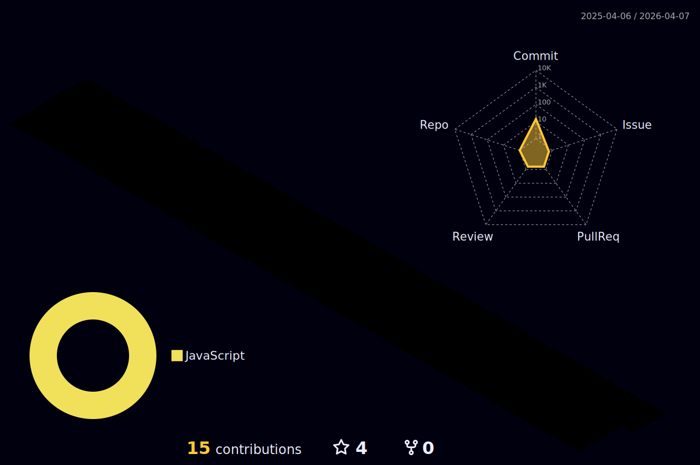

<h2 align="center">🛠 Language and Tools 🛠</h2>
 

  
  
   
  
  
   
   
  
  
   
  
  
   
   
   
   
  
  
  

 
<h2 align="center">🔥 Mai Quốc Trưởng's GitHub Stats 🔥</h2>
 

  
  

 
<h2 align="center">👽 Where to find me 👽</h2>
 

  
  
  
  

